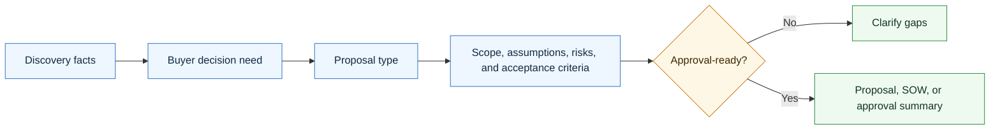
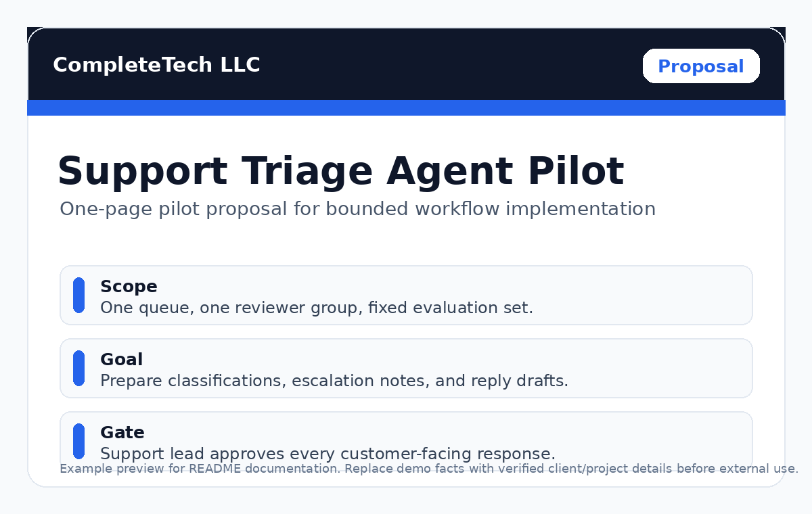

# Agentic Proposal Skill

<p align="center">
  
</p>

A CompleteTech LLC Codex skill for creating proposal and SOW-style documents for agentic development opportunities.

## About

Part of the CompleteTech LLC agentic services skill library. This skill turns verified discovery into buyer-facing proposals, SOWs, pilot recommendations, roadmaps, risk plans, and approval artifacts.

## OpenClaw / ClawHub Metadata

- Skill key: `agentic-proposal-skill`
- Version-ready metadata: `1.0.0`
- Homepage: https://github.com/CompleteTech-LLC/agentic-proposal-skill
- README: https://github.com/CompleteTech-LLC/agentic-proposal-skill#readme
- Runtime binaries: `python3`
- Python packages: none
- Intended registry/discovery tags: `latest`, `complete-tech`, `codex-skill`, `agentic-development`, `agentic-workflows`, `proposal`, `sow`, `sales`
- License: repository code, templates, and documentation use MIT; ClawHub publishing is intentionally skipped for now.
- Brand assets: CompleteTech LLC names, logos, seals, and brand assets are reserved; see `BRAND_ASSETS.md`.

## Workflow Diagram



## What It Does

- Selects the right proposal document by buyer stage and decision need.
- Drafts discovery recaps, one-page pilots, full proposals, SOWs, roadmaps, evaluation plans, risk/control plans, change orders, retainer proposals, and buyer approval summaries.
- Bridges the gap between outreach emails and signed contracts/invoices.
- Keeps the offer focused on practical, bounded agentic workflow implementation with human approval gates, evaluation, monitoring, documentation, support, and handoff.

## Contents

- `SKILL.md` - operating instructions and proposal-selection guide.
- `references/proposal-catalog.md` - reusable proposal and SOW templates.
- `references/use-case-decision-table.md` - quick guide for choosing the right document.
- `references/proposal-lifecycle.md` - end-to-end proposal flow and handoff points.
- `references/proposal-positioning.md` - CompleteTech LLC proposal language and guardrails.
- `scripts/render_proposal.py` - deterministic template listing and rendering helper.

## Quick Start

```bash
python3 scripts/render_proposal.py --list
python3 scripts/render_proposal.py \
  --template one-page-pilot-proposal \
  --var client_name=Acme \
  --var workflow="support triage" \
  --var pain="manual queue review is slowing response times"
```

Rendered templates are drafts. Replace placeholders with verified client, scope, timeline, pricing, risk, and approval details before use.

## Example



**One-page pilot proposal: Support triage agent**

```bash
python3 scripts/render_proposal.py \
  --template one-page-pilot-proposal \
  --var client_name="Northstar Support" \
  --var workflow="support triage agent" \
  --var pain="manual queue review slows escalation and creates uneven customer notes" \
  --var pilot_goal="prepare consistent classifications, escalation notes, and reply drafts for human approval" \
  --var approval_gate="support lead approves every customer-facing response"
```

Example proposal frame:

- Build a bounded pilot around one queue, one reviewer group, and a fixed set of evaluation examples.
- Include assumptions, exclusions, acceptance criteria, monitoring, and handoff from the start.
- Route sensitive data, tool access, and launch questions to `agentic-security-review-skill` before production use.

## Brand Notes

Use a direct, concrete, low-hype tone. Present agentic development as bounded workflow implementation: workflow discovery, tool routing, retrieval, approval gates, evaluation examples, logs, monitoring, documentation, and handoff. Do not invent proof, regulated-use assurances, legal claims, savings metrics, or client facts.

## License

Code, templates, and documentation are licensed under the MIT License. CompleteTech LLC names, logos, seals, and brand assets are reserved and are not licensed for reuse except to identify this project. See `LICENSE` and `BRAND_ASSETS.md`.
